 

---

### `gtxprime@github ~ $ whoami`

<table>
  <tr>
    <td valign="top"></td>
    <td valign="top"></td>
  </tr>
</table>

 

---

### `gtxprime@github ~ $ cat tech-stack.sh`

 

---

### `gtxprime@github ~ $ gh api stats`

 

### `gtxprime@github ~ $ git log --language-breakdown`

 

---

### `gtxprime@github ~ $ ./matrix.sh`

 

---

### `gtxprime@github ~ $ ./contributions.sh`

 

---

### `gtxprime@github ~ $ ./showcase_projects.sh`

